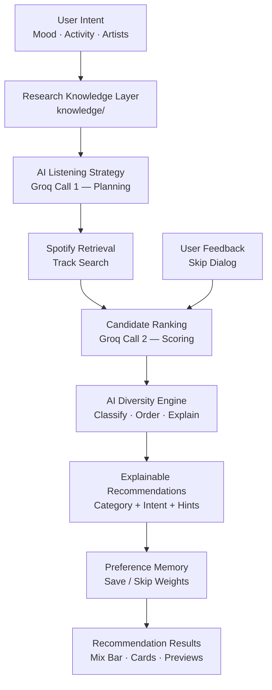
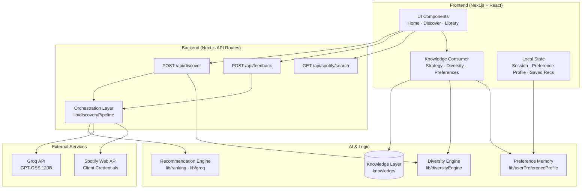
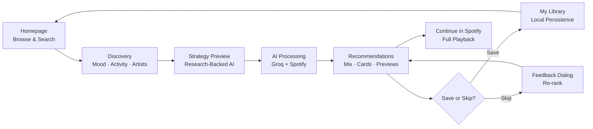
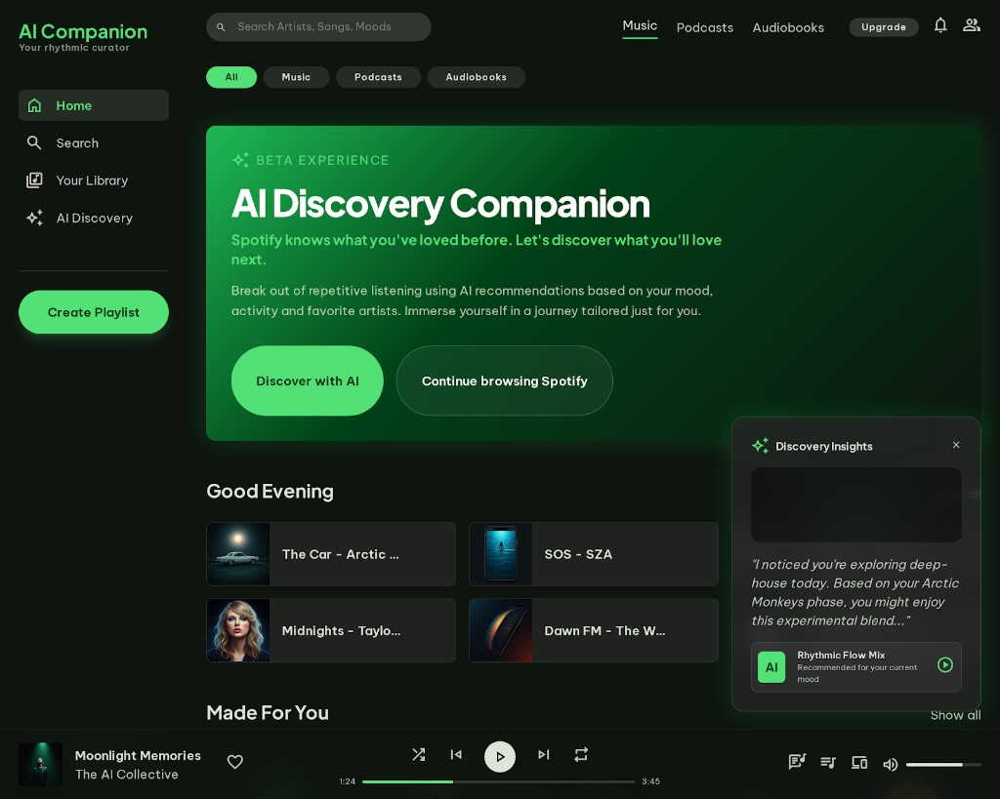
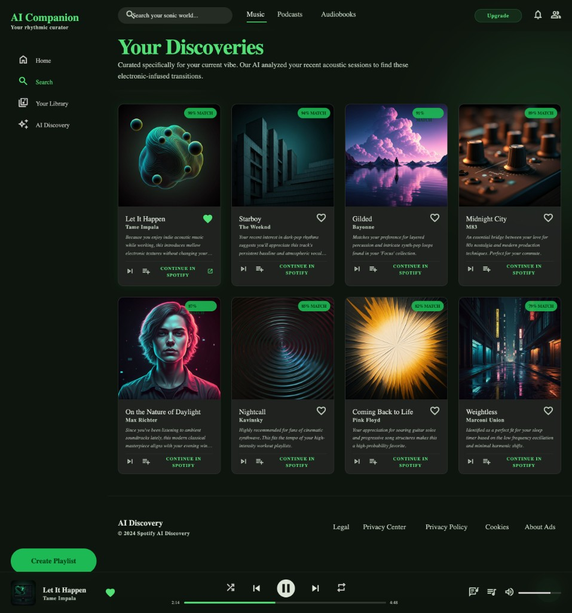

# Spotify Discovery Companion

**An AI-powered music discovery layer that turns user research into explainable, diverse recommendations.**

[](#live-demo)
[](https://github.com/Rukhsar24081998/spotify-discovery-companion)
[](./LICENSE)
[](https://nextjs.org/)
[](https://www.typescriptlang.org/)
[](https://groq.com/)
[](https://developer.spotify.com/documentation/web-api)
[](https://vercel.com/)

<!-- Hero screenshot placeholder — replace with production capture after deployment -->
<!--  -->

*Hero screenshot placeholder — add `./screenshots/hero.png` after deployment.*

### Live Demo

> **Placeholder:** Production URL not yet deployed. After Vercel deploy, replace this section with the live URL (e.g. `https://your-app.vercel.app`). Until then, run locally via [Installation](#installation) or follow [Deploy on Vercel](#deploy-on-vercel).

Spotify Discovery Companion is a research-driven AI layer built on top of Spotify that improves music discovery through explainable recommendations, diversity-aware ranking, and adaptive preference learning. It is a graduation project and portfolio product that sits *on top of* Spotify's catalog — helping daily listeners break out of repetitive playlists by expressing **current intent** (mood, activity, inspiration artists) and receiving **transparent, research-backed recommendations** with 30-second previews.

Built from analysis of **183 Spotify user reviews** across Google Play, the App Store, Reddit, and the Spotify Community, the product translates real discovery pain points into AI features: a research knowledge layer, diversity engine, explainable ranking, and lightweight preference memory.

### Project at a Glance

| Metric | Value |
| --- | --- |
| Reviews Analyzed | 183 |
| AI Features | 7 |
| Discovery Principles | 7 |
| User Personas | 5 |
| Supported Moods | 8 |
| Supported Activities | 8 |
| Recommendation Categories | 4 |

---

## Problem Statement

Spotify has one of the most sophisticated recommendation systems in the world — yet millions of users still return to the same playlists, liked songs, and familiar artists every day. The platform excels at predicting **what you have enjoyed historically**, but struggles to answer a different question:

> **What does the user want to listen to right now?**

To understand why, this project analyzed **183 public Spotify user reviews** collected from Google Play Store, Apple App Store, Reddit, and the Spotify Community. The research revealed a consistent pattern: discovery is not failing because users lack music — it is failing because recommendations feel **repetitive**, **opaque**, and **disconnected from present-moment context**.

Users reported that algorithmic feeds optimize for familiarity over exploration, that skip and save actions rarely feel meaningful, and that they often discover music on social platforms before searching for it on Spotify. Without mood-aware curation, explainable reasoning, and confidence-building previews, listeners default to comfort — and recommendation fatigue sets in.

Spotify Discovery Companion addresses this gap as an **optional AI reasoning layer**: it does not replace Spotify's engine, but complements it with intent-driven discovery, transparent explanations, and research-informed diversity.

---

## Research Insights

The following table maps validated research findings to concrete product decisions implemented in the application.

| Research Finding | Product Decision |
| --- | --- |
| Recommendation fatigue | **AI Diversity Engine** — classifies picks into Familiar Favorites, Similar Artists, Hidden Gems, and Wildcard Discoveries; alternates categories to reduce repetition |
| Lack of transparency | **Explainable AI** — every recommendation references its diversity category and the user's mood/activity intent |
| Weak personalization | **Research-Backed Listening Strategy** — mood × activity strategy generated from structured discovery principles |
| Limited user control | **Preference Memory** — save/skip actions adjust a lightweight local style profile |
| Hidden gems difficult to discover | **Discovery-first ranking** — popularity-aware classification surfaces lesser-known artists with strong contextual fit |
| Repetitive playlists | **Recommendation Mix** — visual summary of category balance above results |
| Context ignored | **Intent capture flow** — mood, activity, and optional inspiration artists drive the AI pipeline |
| Uncertainty before trying new music | **30-second Spotify previews** — listen before committing; open full track in Spotify |

Research data is codified in the read-only [`knowledge/`](./knowledge/) layer — a structured product knowledge base consumed by all AI intelligence modules.

---

## Product Vision

Music discovery should feel intentional, not accidental. Instead of pushing users toward endless engagement loops, Spotify Discovery Companion is designed around **meaningful discovery** — helping listeners find music that fits their current moment while gradually expanding their taste.

The product vision starts with **intent**. Daily Spotify users aged 18–28 listen while studying, working, commuting, working out, and relaxing. Their needs shift hour by hour. A recommendation system that only knows their past cannot reliably serve their present. This companion captures that present-moment context and uses AI to reason about what fits *now*.

The second pillar is **trust through explainability**. Users in the research study said they would try unfamiliar songs if they understood why those songs were suggested. Every recommendation in this product carries a human-readable explanation tied to both category and context — reducing the uncertainty that drives skip-heavy behavior.

The third pillar is **balanced exploration**. Pure novelty overwhelms; pure familiarity breeds fatigue. The diversity engine deliberately mixes comfort picks with adjacent artists, hidden gems, and carefully chosen wildcards — a pattern derived directly from review analysis showing users want safety *and* surprise in the same session.

Finally, the product treats discovery as a **learning loop**. Lightweight preference memory stores save and skip signals locally, allowing future sessions to reflect evolving taste without requiring a database, account system, or opaque model retraining. The goal is human-centered AI: transparent, controllable, and grounded in real user research.

---

## Solution Overview

Spotify Discovery Companion guides users through a focused discovery journey:

1. **Express intent** — select mood, activity, and optional inspiration artists
2. **Preview the AI strategy** — see how research principles shape the upcoming search
3. **Receive ranked recommendations** — live tracks from Spotify with scores, explanations, and previews
4. **Save or skip** — build preference memory and trigger feedback-driven re-ranking
5. **Return to My Library** — revisit saved discoveries grouped by recency

### Major AI Features

| Feature | What It Does |
| --- | --- |
| **Research-Backed AI Strategy** | Surfaces five discovery principles and a personalized strategy paragraph before recommendations run — grounded in the `knowledge/` layer |
| **AI Diversity Engine** | Classifies every track into one of four categories and re-orders results to alternate types, reducing list repetition |
| **Explainable Recommendations** | Combines category rationale, mood/activity alignment, and optional preference hints into every explanation |
| **Preference Memory** | Stores save/skip style weights in `localStorage` — no backend database required |
| **Recommendation Mix** | Displays live counts per diversity category with a research citation |
| **Live Spotify Integration** | Server-side Spotify Web API search, album art, preview URLs, and deep links to open tracks in Spotify |
| **My Library** | Persists saved recommendations locally with timestamp grouping (Today / Yesterday / Earlier) |

---

## Research-Driven AI Recommendation Pipeline

The discovery flow combines frontend intelligence, a structured knowledge layer, server-side LLM reasoning, and post-processing enrichment.



**Two-call Groq architecture** keeps latency manageable:

- **Call 1 (Planning):** `{ mood, activity, favoriteArtists }` → `{ intent, strategy, searchQuery }`
- **Spotify Search:** retrieves real catalog candidates with metadata and preview URLs
- **Call 2 (Ranking):** scores candidates, assigns discovery scores (0–100), and generates initial explanations
- **Frontend enrichment:** diversity classification, balanced ordering, and knowledge-layer explanation copy

Feedback re-ranking adds at most one additional Groq call and reuses the cached candidate pool.

---

## System Architecture & Intelligence Flow



| Layer | Responsibility |
| --- | --- |
| **Frontend** | Captures intent, renders discovery flow, runs preview player, holds client session state |
| **API Routes** | Orchestrates Groq + Spotify calls; validates input; never exposes secrets |
| **Knowledge Layer** | Read-only research insights, principles, objectives, and user segments |
| **Recommendation Engine** | Groq planning + ranking, trackId reconciliation, variety enforcement |
| **Diversity Engine** | Category classification, balanced ordering, explainable copy |
| **Preference Memory** | localStorage profile updated on save/skip |
| **Groq** | Contextual reasoning and natural-language explanations |
| **Spotify API** | Catalog source of truth — search, metadata, artwork, previews |

All API keys are server-side only. There is no database; session and preference state live in the browser.

---

## User Journey



---

## Key Features

| Feature | Description | Business Value |
| --- | --- | --- |
| Intent-driven discovery | Users select mood, activity, and optional inspiration artists before any AI runs | Aligns recommendations with present-moment context instead of historical taste alone |
| Research-backed strategy preview | Shows principles and a personalized strategy paragraph sourced from 183-review analysis | Builds trust and sets expectations before results appear |
| Two-call Groq pipeline | Planning + ranking with Spotify search between calls | Balances reasoning quality with acceptable latency |
| AI Diversity Engine | Four-category classification with rotation-based ordering | Directly addresses recommendation fatigue — the #1 pain point in user research |
| Explainable recommendations | Category + mood/activity + preference hints in every card | Reduces uncertainty; increases willingness to try unfamiliar tracks |
| Recommendation Mix bar | Live category counts with research citation | Makes diversity tangible — users see balance, not a black box |
| Preference Memory | localStorage weights updated on save/skip | Gives users control; future explanations reflect learned taste |
| 30-second previews | Embedded Spotify preview player on each card | Confidence-building before full-track commitment |
| Feedback re-ranking | Skip-triggered dialog sends reason to Groq for session re-rank | Closes the loop between user signal and AI output |
| My Library | Saved recommendations grouped by Today / Yesterday / Earlier | Encourages return visits and ongoing discovery within the product |
| Global Spotify search | Server-side artist/track search with recent search history | Supports inspiration artist selection and catalog exploration |
| Responsive shell | Desktop sidebar + mobile bottom nav + compact player | Production-quality UX across form factors |

---

## Tech Stack

### Frontend

| Technology | Purpose |
| --- | --- |
| Next.js 15 (App Router) | Full-stack React framework, API routes, routing |
| React 19 | Component architecture and client interactivity |
| TypeScript (strict) | End-to-end type safety across UI, lib, and API contracts |
| Tailwind CSS | Dark-theme design system and responsive layout |
| Lucide React | Icon system |

### Backend

| Technology | Purpose |
| --- | --- |
| Next.js API Routes | `/api/discover`, `/api/feedback`, `/api/spotify/search` |
| Native `fetch` | Groq and Spotify HTTP clients (no SDK dependency) |
| Shared contracts (`types/`) | Single source of truth for request/response shapes |

### AI

| Technology | Purpose |
| --- | --- |
| Groq API | LLM reasoning — planning, ranking, feedback re-ranking |
| OpenAI GPT-OSS 120B (`openai/gpt-oss-120b`) | Primary model for planning and ranking |
| OpenAI GPT-OSS 20B (`openai/gpt-oss-20b`) | Fallback planning model |
| Knowledge Layer (`knowledge/`) | Structured research insights consumed by frontend AI modules |
| Diversity Engine (`lib/diversityEngine.ts`) | Classification, ordering, and explanation enrichment |
| Prompt templates (`lib/prompts.ts`) | Versioned, isolated Groq prompt builders |

### Deployment

| Technology | Purpose |
| --- | --- |
| Vercel | Serverless hosting for Next.js |
| Environment variables | Server-only secrets (`GROQ_API_KEY`, Spotify credentials) |
| Stateless API design | No database; horizontally scalable serverless functions |

---

## Folder Structure

```text
app/
  page.tsx                      # Homepage
  layout.tsx                    # Root layout + dark theme
  discover/page.tsx             # Discovery flow entry
  api/
    discover/route.ts           # POST /api/discover — Groq + Spotify orchestration
    feedback/route.ts           # POST /api/feedback — skip-driven re-ranking
    spotify/search/route.ts     # GET /api/spotify/search — artist/track search

components/
  home/                         # Homepage browse sections
  discover/                     # Discovery flow UI (strategy, mix bar, pipeline)
  layout/                       # Shell, sidebar, nav, player, library, search
  ui/                           # Shared primitives (CardShell, PillButton, …)
  DiscoveryFlow.tsx             # Core discovery state machine
  RecommendationCard.tsx        # Recommendation card with preview + actions

knowledge/                      # Read-only research knowledge layer
  researchInsights.ts           # 183-review findings and copy helpers
  discoveryPrinciples.ts        # Discovery principles + preference feedback copy
  recommendationObjectives.ts   # Goals, category copy, diversity rotation
  userSegments.ts               # Research-backed personas

lib/
  groq.ts                       # Groq service (planning, ranking, re-ranking)
  spotify.ts                    # Spotify Client Credentials + search
  prompts.ts                    # Versioned LLM prompt builders
  ranking.ts                    # Post-processing, reconciliation, variety
  diversityEngine.ts            # Classification, ordering, explanations
  recommendationClassifier.ts   # Four-category diversity classifier
  researchBackedStrategy.ts     # Strategy builder (consumes knowledge/)
  userPreferenceProfile.ts      # localStorage preference memory
  savedRecommendations.ts       # My Library persistence
  recentSearches.ts             # Global search history

types/
  index.ts                      # Shared TypeScript contracts

docs/                           # Product & engineering documentation
public/                         # Static assets (images, icons)
styles/                         # Global Tailwind styles
scripts/                        # Dev utilities (preview/plan measurement)
design-reference/               # UI reference screenshots
phase-wise-implementation-plan/ # Phased engineering plan & checklist
```

Product documentation in [`docs/`](./docs/) is the engineering source of truth. The [`knowledge/`](./knowledge/) folder is the product intelligence source of truth.

---

## Installation

### Prerequisites

- Node.js 18.18+ (developed on Node 24)

### Setup

```bash
git clone https://github.com/Rukhsar24081998/spotify-discovery-companion.git
cd spotify-discovery-companion
npm install
cp .env.example .env.local
# Fill in environment variables (see below)
npm run dev
```

Open [http://localhost:3000](http://localhost:3000) → **Discover** → select mood and activity → view strategy → receive recommendations.

### Scripts

```bash
npm run dev      # Start development server
npm run build    # Production build
npm run start    # Run production build
npm run lint     # ESLint
```

### Deploy on Vercel

1. Import the repository in the [Vercel dashboard](https://vercel.com/new).
2. Framework preset: **Next.js** (auto-detected).
3. Add required environment variables under **Project → Settings → Environment Variables**.
4. Deploy and verify: Home → Discover → recommendations → preview → save/skip → My Library.

---

## Environment Variables

Copy `.env.example` to `.env.local`. All keys are server-side only and must never be prefixed with `NEXT_PUBLIC_`.

| Variable | Required | Purpose |
| --- | --- | --- |
| `GROQ_API_KEY` | Yes | Groq API key for LLM planning and ranking |
| `SPOTIFY_CLIENT_ID` | Yes | Spotify application client ID |
| `SPOTIFY_CLIENT_SECRET` | Yes | Spotify application client secret |
| `SPOTIFY_MARKET` | No | ISO market code for search (e.g. `US`, `IN`) |

`.env.local` is git-ignored. Never commit secrets.

---

## Screenshots

Screenshots are grouped below. Design-reference captures are included where available; remaining slots are marked as placeholders for post-deployment capture.

### Product Screenshots (Available)

#### Homepage



#### AI Discovery


#### Research-Backed Strategy


#### Recommendation Results



### Product Screenshots (Placeholders)

> Add the following captures after deployment and save to `./screenshots/`.

#### Hero Overview

<!--  -->
*Placeholder — `./screenshots/hero.png`*

#### My Library

<!--  -->
*Placeholder — `./screenshots/my-library.png`*

#### Mobile View

<!--  -->
*Placeholder — `./screenshots/mobile.png`*

---

## Research Intelligence Layer

Spotify Discovery Companion was designed using insights generated by the [Spotify Review Analysis Engine](https://github.com/Rukhsar24081998/spotify-review-engine).

Before building the MVP, an AI-powered Review Analysis Engine analyzed Spotify user feedback collected from public sources including Google Play Store, Apple App Store, Reddit, Spotify Community, and Social Media. The engine transformed unstructured qualitative feedback into structured product insights by identifying recurring pain points, user behaviors, unmet needs, and discovery opportunities.

Those validated insights directly informed the design of this AI-native MVP, including:

* Research-backed AI Strategy
* AI Diversity Engine
* Explainable Recommendations
* Preference Memory
* Discovery-first Ranking
* Intent-aware Personalization

**Repository:** https://github.com/Rukhsar24081998/spotify-review-engine

Together, the Review Analysis Engine and Spotify Discovery Companion demonstrate the complete AI Product Management workflow—from large-scale research and user insight generation to a deployed AI-native product.

---

## Future Roadmap

| Initiative | Description |
| --- | --- |
| **Semantic Retrieval** | Embedding-based candidate retrieval beyond keyword search |
| **Embeddings** | Audio and metadata vector representations for deeper similarity |
| **Conversational Discovery** | Natural-language discovery sessions instead of form-based input |
| **Playlist Generation** | Multi-track playlist creation from a single intent session |
| **Collaborative Filtering** | Cross-user taste signals while preserving privacy |
| **Multi-session Memory** | Persistent preference profiles beyond localStorage |
| **Audio Feature Ranking** | Tempo, energy, and valence signals in ranking prompts |

---

## Learnings

### AI Product Management

Shipping this product required treating AI as a **product layer**, not a feature checkbox. The two-call Groq architecture exists because latency and cost are product constraints — not engineering preferences. Every AI output maps to a user-visible outcome: strategy preview, discovery score, explanation, or mix category.

### User Research

Analysis of 183 reviews provided a defensible foundation for product decisions. The research-to-feature mapping (fatigue → diversity engine, opacity → explainability) made prioritization straightforward and gave judges and recruiters a clear narrative: **problem → insight → decision → feature**.

### Explainable AI

Explainability was not added as post-hoc copy — it is structural. Category classification, intent alignment, and preference hints are composed from the knowledge layer. This taught that XAI in consumer products works best when explanations are **consistent, templated, and tied to user actions** rather than free-form LLM prose alone.

### Recommendation Systems

Pure similarity ranking produces fatigue. The diversity engine demonstrated that **post-ranking enrichment** — classify, alternate, explain — can improve perceived quality without retraining a collaborative filter. Balancing familiarity and exploration is a product design problem as much as an algorithmic one.

### Product Discovery

The companion model (optional layer on an existing platform) reduced scope while keeping impact high. Instead of rebuilding Spotify, the product focuses on the one job Spotify's algorithm under-serves: **intent-driven discovery with transparency**.

### Human-Centered AI

Preference memory uses localStorage — not because a database is impossible, but because user control and privacy matter. Save/skip messages ("Future recommendations will include more music like this") close the feedback loop in language users understand. AI should feel **responsive and legible**, not magical and opaque.

---

## Why This Project Is Different

| Dimension | Spotify (Default Experience) | Spotify Discovery Companion |
| --- | --- | --- |
| **Primary goal** | Engagement and retention | Meaningful discovery |
| **Signal source** | Historical listening + collaborative filtering | Present-moment mood, activity, and intent |
| **Adaptation** | Static algorithmic feeds | Session-adaptive strategy + preference memory |
| **Transparency** | Black-box recommendations | Category-labeled, intent-aligned explanations |
| **Diversity** | Similarity-biased ranking | Research-backed four-category mix with rotation ordering |
| **Foundation** | Platform-scale algorithm | 183-review research knowledge layer |
| **User control** | Limited feedback visibility | Save/skip preference weights + feedback re-ranking |
| **Confidence** | Play-first discovery | 30-second previews before full-track commitment |
| **Architecture** | Proprietary internal systems | Open, documented two-call LLM + Spotify pipeline |

---

## Documentation

| Resource | Description |
| --- | --- |
| [`docs/problem-statement.md`](./docs/problem-statement.md) | Problem framing and research background |
| [`docs/ai-workflow.md`](./docs/ai-workflow.md) | Complete AI pipeline and responsibility matrix |
| [`docs/tech-stack.md`](./docs/tech-stack.md) | Technical architecture and security conventions |
| [`ARCHITECTURE.md`](./ARCHITECTURE.md) | As-built architecture reference |
| [`knowledge/`](./knowledge/) | Structured research knowledge layer |
| [`phase-wise-implementation-plan/`](./phase-wise-implementation-plan/) | Phased engineering plan (Phases 01–12 complete) |

---

## License

This project is licensed under the MIT License. See the [LICENSE](./LICENSE) file for details.

---

**An AI Product Management graduation project** — grounded in user research, built with explainable AI, shaped by product thinking, and designed discovery-first.
